# Advanced Large Language Models & Visualization Tools for Data Analytics Learning

Welcome to our project on **Advanced Large Language Models & Visualization Tools for Data Analytics Learning**! Our mission is to revolutionize the way non-computational professionals and students learn data analytics. We do this by harnessing the power of cutting-edge AI technologies like [GPT-4](https://openai.com/index/gpt-4-research/) and the advanced visualization capabilities of tools like [LIDA](https://github.com/microsoft/lida). Our research, supported by extensive case studies and published in specialized conferences and journals, shows how these tools can drastically improve both the speed and quality of data-related disciplines education. Join us on this exciting journey to make data analytics and data science more accessible, efficient, and engaging for everyone!


## Project Overview

This project, based on two comprehensive studies, explores the use of advanced Large Language Models (LLMs) and visualization tools to enhance data analytics learning for students and professionals from non-computational backgrounds. The methodologies and outcomes described herein underscore the significant benefits of integrating cutting-edge AI technologies such as based on Generative AI (GenAI) into educational practices to foster a deeper understanding and more efficient execution of data-related projects.

### Project Objectives

- Promote a comprehensive understanding of data-based project pipelines.
- Enhance programming and other computational thinking-related skills through interactive AI assistance.
- Enable wider adoption of GenAI tools in educational contexts.
- Improve the efficiency and effectiveness of data-related project development.


### Methodology
The project unfolds in several key stages, as outlined in the case studies:

### Participants and sample composition
We worked with **59 participants** (students and professionals) at Tecnológico de Monterrey across a broad set of disciplinary backgrounds. Understanding who took part is essential for reading the results.

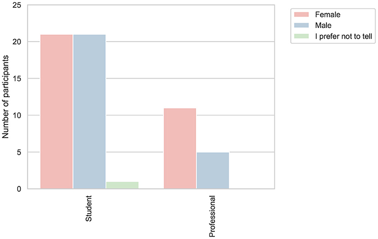

*Figure 1 — Current role by gender.*

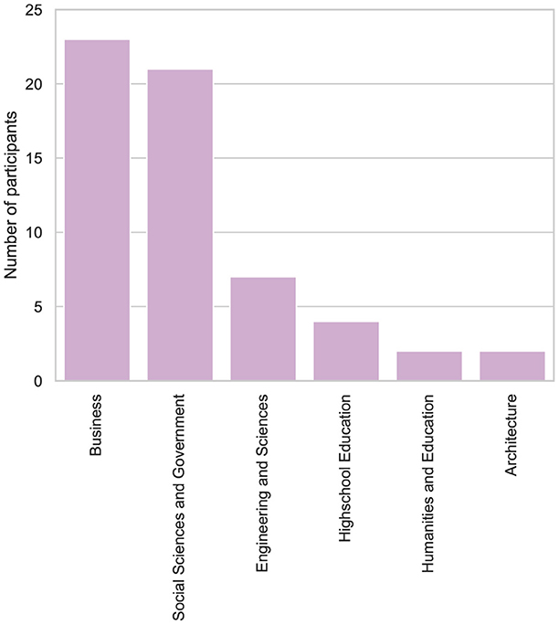

*Figure 2 — Affiliation (major field or sector).*

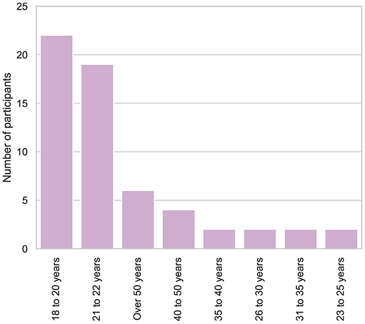

*Figure 3 — Age distribution.*

Students and professionals from non-computational backgrounds. Specifically, 88% of participants came from fields such as finance, business, social sciences, and others, while the remaining 12% were from engineering disciplines including sustainable engineering, chemical engineering, biomedical engineering, and industrial engineering. 
In addition to demographics, we documented prior exposure to programming, analytics, and AI tools to contextualize later perceptions:

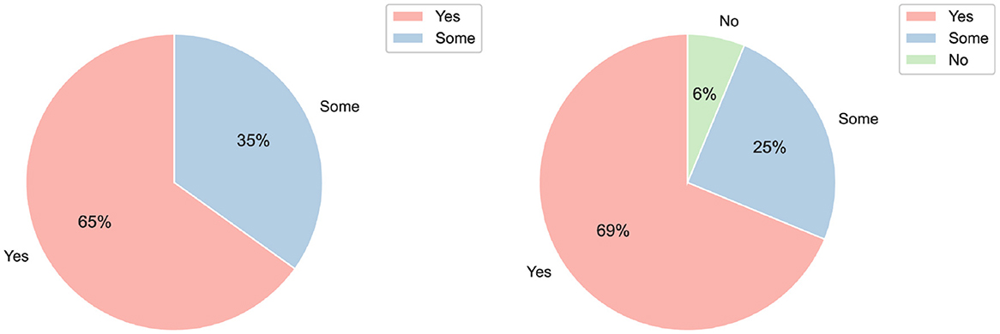
*Figure 4 — Programming experience (Students vs. Professionals).*

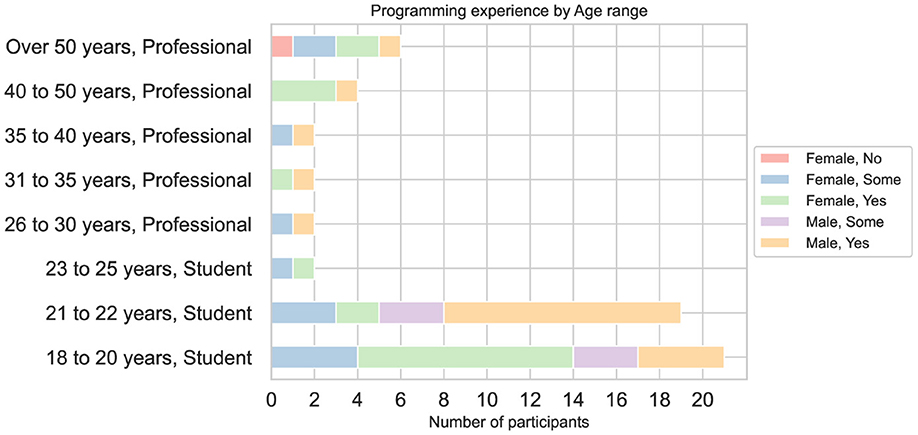
*Figure 5 — Programming experience broken down by age, role, and gender.*

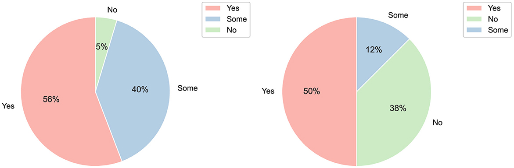
*Figure 6 — Data analytics experience (Students vs. Professionals).*

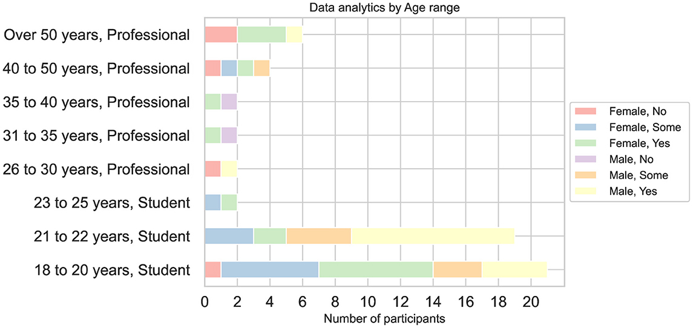
*Figure 7 — Experience with Python/Colab and related tools.*

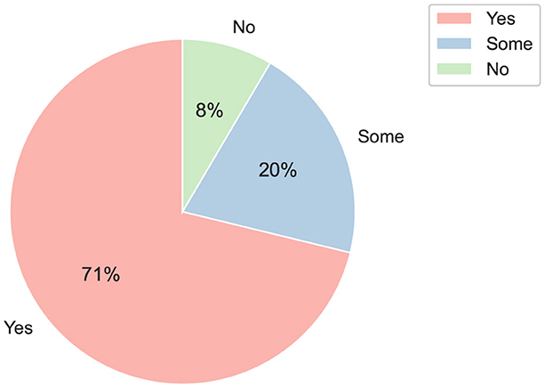
*Figure 8 — Experience with ChatGPT/GenAI in general, for programming, for analytics, and with generative APIs.*


#### Case Study Design
- Traditional Approach: Participants first completed a data analytics project using standard Python packages (e.g., scikit-learn, pandas, seaborn) in Google Colab.
- ChatGPT Approach: Participants then repeated the project with conventional ChatGPT assistance, using the tool mainly for generating code snippets.
- LIDA + GPT Approach: Finally, participants completed the project using LIDA integrated with the GPT-4 API, enabling automated data summarization, exploration, and advanced visualizations in response to any prompt originating from the project’s source code itself.


### Motivation
Teaching data analytics to learners from **non-computing backgrounds** is challenging: mastering code, reasoning about data, and producing clear visual evidence can feel like three separate hurdles. This study examines whether **visualization-aware uses of Generative AI (GenAI)** can lower those hurdles in formal education, not by replacing instruction, but by aligning assistance with the goals of an analytics pipeline.


### Experimental setup
All participants completed the **same analytics project** within a timed session that emphasized three CRISP-DM phases explicitly taught beforehand: **Business Understanding**, **Data Understanding**, and **Evaluation**. To compare workflows fairly, each person experienced **three approaches** to the same task:

- **Approach 1 — Traditional:** standard Python stack (e.g., pandas, matplotlib, seaborn, scikit-learn).
- **Approach 2 — ChatGPT:** conversational assistance to produce and refine code and explanations.
- **Approach 3 — LIDA + GPT (API orchestration):** model-assisted summaries, goal proposals, and visualization specifications integrated into the programming flow.

The session was paced and instrumented to capture not only **time-to-completion** but also **perceived qualities** of each approach: *ease of use*, *speed of result*, *appropriateness* (fit to the analytical goal), and *correctness* of outcomes.

### Results
We summarize the main findings here; the figures show the distributions that underpin each statement.

**1) Time to finish.**  
Approaches supported by GenAI enabled faster completion for many participants. In particular, **ChatGPT** frequently concentrated times in the lower intervals, while **Traditional** clustered toward longer spans. Professionals tended to finish faster, but students benefited markedly from AI support.

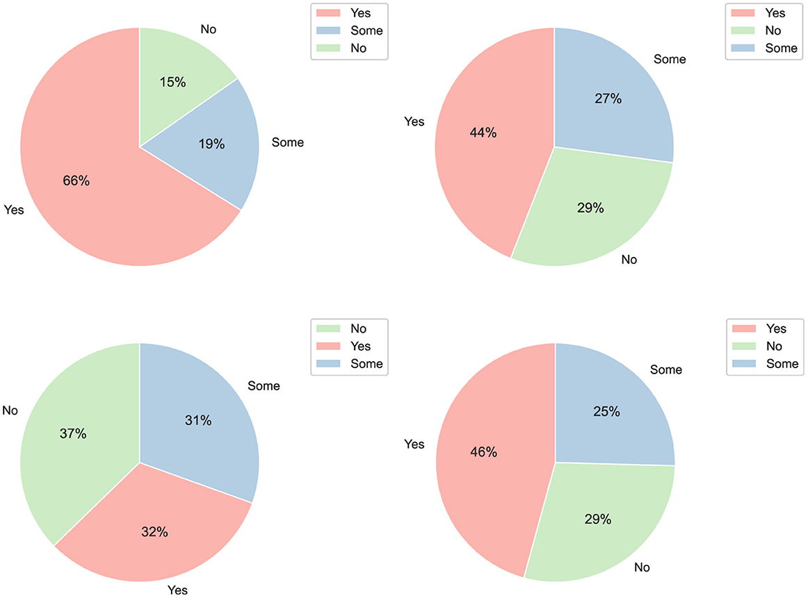
*Figure 9 — Time required by approach and role (stacked categories).*

*(If your repository includes an additional time-distribution panel, include it here as well.)*

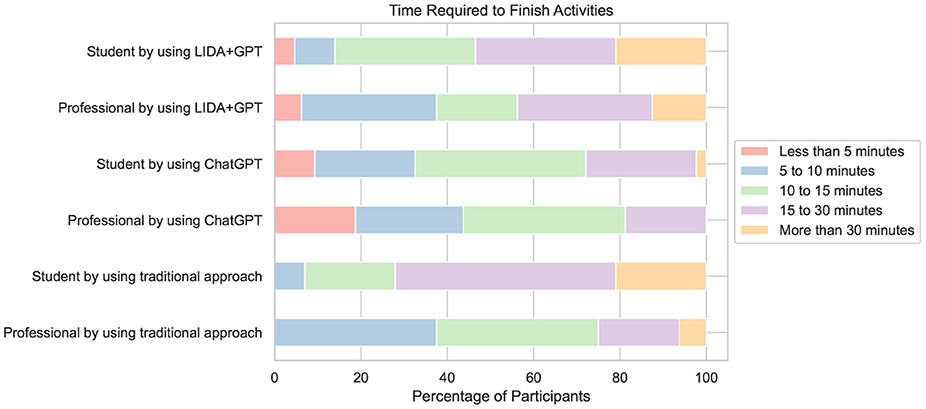
*Figure 10 — Complementary time distribution (if provided in your image set).*

**2) Perceived ease and speed.**  
Across roles and genders, participants most often identified **ChatGPT** as the **easiest** and **fastest** way to progress once the task was understood.

**3) Perceived appropriateness and correctness.**  
When the criterion shifted to **fit to the analytical objective** and **correctness** of outputs, **LIDA + GPT** was most frequently favored. Its structured flow (summary → goals → visualization spec) helped keep attention on the target once configured.

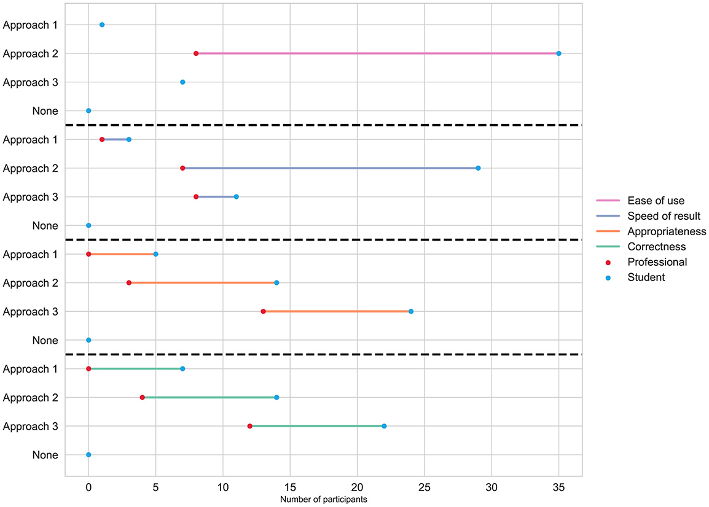
*Figure 11 — Ease, Speed, Appropriateness, Correctness by role (Students vs. Professionals).*

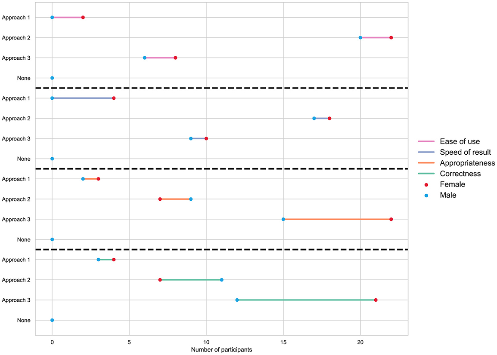
*Figure 12 — The same four metrics by gender.*

### Discussion
The three approaches display **distinct learning curves**. The **Traditional** path asks novices to integrate many components, which costs time and attention. **ChatGPT** reduces the startup load and accelerates iteration, but it still requires careful human judgment to verify and assemble a coherent solution. **LIDA + GPT** introduces initial overhead (API setup and configuration) followed by a smoother, goal-oriented path that participants perceived as more appropriate and correct.

### Conclusions
Taken together, the results suggest that **visualization-aware GenAI** can support learners from non-computing backgrounds in completing the same analytics project **more efficiently**, while aligning outputs with clearly defined goals. The pattern is consistent across roles and genders: **ChatGPT** is perceived as the fastest on-ramp, whereas **LIDA + GPT** is perceived as best aligned with task requirements and correctness once the pipeline is in place.

---

## How to embed the figures (PNG) in your README

1. Place the PNG files in your repository under `images/` with the exact names used above (e.g., `images/IMAGEN1.png`, `images/IMAGEN2.png`, …, `images/IMAGEN12.png`).  
2. Use standard Markdown syntax to embed them where relevant in your narrative:
   ```md
   
   *Figure 1 — Current role by gender.*


## Materials
- Journal article published at Frontiers in Education [open access here](https://www.frontiersin.org/journals/education/articles/10.3389/feduc.2024.1418006/full)
- Data from Case Study used to obtain results for our journal article [available here](https://www.frontiersin.org/api/v3/articles/1418006/file/Data_Sheet_1.csv/1418006_supplementary-materials_datasheets_1_csv/1?isPublishedV2=false)
- Conference extended abstract published at proceedings of IACEE 2024 [free access here](https://www.researchgate.net/publication/382695760_Empowering_Data_Analytics_Learning_Leveraging_Advanced_Large_Language_Models_and_Visualization_Tools)
- Conference presentation [access here](https://github.com/jvalverr/data-analytics-education/blob/main/materials/session7-JorgeValverde-IACEE-24.pdf)

## Citation

When referencing this project, please use the following citation formats:

**Journal Article:**

Valverde-Rebaza, J., González, A., Navarro-Hinojosa, O., & Noguez, J. (2024). *Advanced large language models and visualization tools for data analytics learning*. Front. Educ. 9:1418006. DOI: [10.3389/feduc.2024.1418006](https://www.frontiersin.org/journals/education/articles/10.3389/feduc.2024.1418006/abstract).

```bibtex
@article{valverde:frontiers:24,
  title={Advanced large language models and visualization tools for data analytics learning},
  author={Valverde-Rebaza, J. and González, A. and Navarro-Hinojosa, O. and Noguez, J.},
  journal={Front. Educ.},
  volume={9},
  pages={1418006},
  year={2024},
  doi={10.3389/feduc.2024.1418006}
}
```

**Conference Extended-Abstract:**

Valverde-Rebaza, J., González, A., Navarro-Hinojosa, O., & Noguez, J. (2024). Empowering Data Analytics Learning: Leveraging Advanced Large Language Models and Visualization Tools. Proceedings of the 19th World Conference on Continuing Engineering Education, IACEE 2024, pp. 47-49. ISBN: 978-1-7327114-3-3.

```bibtex
@inproceedings{Valverde:iacee:24b, 
 author = {Valverde-Rebaza, J. and González, A. and Navarro-Hinojosa, O. and Noguez, J.},
 title = {{Empowering Data Analytics Learning: Leveraging Advanced Large Language Models and Visualization Tools}},
 booktitle = {Proceedings of The 19th World Conference on Continuing Engineering Education},
 series = {IACEE 2024},
 pages = {47--49},
 isbn = {978-1-7327114-3-3},
 publisher = {IACEE},
 year = {2024}
}
```
